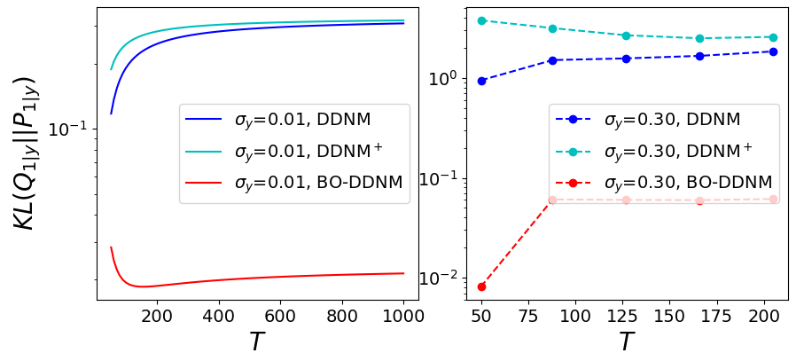
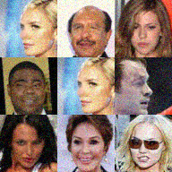

# Zero-shot Conditional DDPM samplers


## Features

- DDPM[^1] and DDIM[^2] for conditional sampling
	- Image colorization, denoising, and inpainting
	- Optimal Exponential-Then-Constant noise schedule[^3]
- DDNM[^4] zero-shot conditional sampler
- BO-DDNM[^5] zero-shot conditional sampler
- Evaluation metrics
	- KL-divergence for synthetic data
	- MSE
	- Fréchet Inception Distance[^6] (FID)
	- Structure Similarity Index Method (SSIM)
	- Learned Perceptual Image Patch Similarity[^7] (LPIPS)

## Requirements

- torch>=1.12.0
- torchvision>=1.13.0
- scipy>=1.7.3


## Code usage

<!-- <p align="center">
	<table width="100%">
		<tr>
			<th width="25%" align="center">Toy data</th>
			<th width="75%" colspan="3" align="center">Real-world data&emsp;</th>
		</tr><tr>
			<th align="center">Training</th>
			<th align="center">Training</th>
			<th align="center">Generation</th>
			<th align="center">Evaluation</th>
		</tr>
			<td><details>
			<summary>Expand</summary>
			<pre><code>
usage: train_toy.py [-h] [--dataset {gaussian8,gaussian25,swissroll}]      
                    [--size SIZE] [--root ROOT] [--epochs EPOCHS] [--lr LR]
                    [--beta1 BETA1] [--beta2 BETA2] [--lr-warmup LR_WARMUP]
                    [--batch-size BATCH_SIZE] [--timesteps TIMESTEPS]      
                    [--beta-schedule {quad,linear,warmup10,warmup50,jsd}]  
                    [--beta-start BETA_START] [--beta-end BETA_END]        
                    [--model-mean-type {mean,x_0,eps}]                     
                    [--model-var-type {learned,fixed-small,fixed-large}]   
                    [--loss-type {kl,mse}] [--image-dir IMAGE_DIR]         
                    [--chkpt-dir CHKPT_DIR] [--chkpt-intv CHKPT_INTV]      
                    [--eval-intv EVAL_INTV] [--seed SEED] [--resume]       
                    [--device DEVICE] [--mid-features MID_FEATURES]        
                    [--num-temporal-layers NUM_TEMPORAL_LAYERS]            
optional arguments:                                                        
  -h, --help            show this help message and exit                    
  --dataset {gaussian8,gaussian25,swissroll}                               
  --size SIZE                                                              
  --root ROOT           root directory of datasets                         
  --epochs EPOCHS       total number of training epochs                    
  --lr LR               learning rate                                      
  --beta1 BETA1         beta_1 in Adam                                     
  --beta2 BETA2         beta_2 in Adam                                     
  --lr-warmup LR_WARMUP                                                    
                        number of warming-up epochs                        
  --batch-size BATCH_SIZE                                                  
  --timesteps TIMESTEPS                                                    
                        number of diffusion steps                          
  --beta-schedule {quad,linear,warmup10,warmup50,jsd}                      
  --beta-start BETA_START                                                  
  --beta-end BETA_END                                                      
  --model-mean-type {mean,x_0,eps}
  --model-var-type {learned,fixed-small,fixed-large}
  --loss-type {kl,mse}
  --image-dir IMAGE_DIR
  --chkpt-dir CHKPT_DIR
  --chkpt-intv CHKPT_INTV
                        frequency of saving a checkpoint
  --eval-intv EVAL_INTV
  --seed SEED           random seed
  --resume              to resume training from a checkpoint
  --device DEVICE
  --mid-features MID_FEATURES
  --num-temporal-layers NUM_TEMPORAL_LAYERS
                </code></pre>
            </details>
			</td><td>
			<details>
				<summary>Expand</summary>
				<pre><code>
usage: train.py [-h] [--dataset {mnist,cifar10,celeba,celebahq}] [--root ROOT]
                [--epochs EPOCHS] [--lr LR] [--beta1 BETA1] [--beta2 BETA2]   
                [--batch-size BATCH_SIZE] [--num-accum NUM_ACCUM]
                [--block-size BLOCK_SIZE] [--timesteps TIMESTEPS]
                [--beta-schedule {quad,linear,warmup10,warmup50,jsd}]
                [--beta-start BETA_START] [--beta-end BETA_END]
                [--model-mean-type {mean,x_0,eps}]
                [--model-var-type {learned,fixed-small,fixed-large}]
                [--loss-type {kl,mse}] [--num-workers NUM_WORKERS]
                [--train-device TRAIN_DEVICE] [--eval-device EVAL_DEVICE]
                [--image-dir IMAGE_DIR] [--image-intv IMAGE_INTV]
                [--num-save-images NUM_SAVE_IMAGES] [--config-dir CONFIG_DIR]
                [--chkpt-dir CHKPT_DIR] [--chkpt-name CHKPT_NAME]
                [--chkpt-intv CHKPT_INTV] [--seed SEED] [--resume]
                [--chkpt-path CHKPT_PATH] [--eval] [--use-ema]
                [--ema-decay EMA_DECAY] [--distributed] [--rigid-launch]
                [--num-gpus NUM_GPUS] [--dry-run]
optional arguments:
  -h, --help            show this help message and exit
  --dataset {mnist,cifar10,celeba,celebahq}
  --root ROOT           root directory of datasets
  --epochs EPOCHS       total number of training epochs
  --lr LR               learning rate
  --beta1 BETA1         beta_1 in Adam
  --beta2 BETA2         beta_2 in Adam
  --batch-size BATCH_SIZE
  --num-accum NUM_ACCUM
                        number of mini-batches before an update
  --block-size BLOCK_SIZE
                        block size used for pixel shuffle
  --timesteps TIMESTEPS
                        number of diffusion steps
  --beta-schedule {quad,linear,warmup10,warmup50,jsd}
  --beta-start BETA_START
  --beta-end BETA_END
  --model-mean-type {mean,x_0,eps}
  --model-var-type {learned,fixed-small,fixed-large}
  --loss-type {kl,mse}
  --chkpt-path CHKPT_PATH
                        checkpoint path used to resume training
  --eval                whether to evaluate fid during training
  --use-ema             whether to use exponential moving average
  --ema-decay EMA_DECAY
                        decay factor of ema
  --distributed         whether to use distributed training
  --rigid-launch        whether to use torch multiprocessing spawn
  --num-gpus NUM_GPUS   number of gpus for distributed training
  --dry-run             test-run till the first model update completes
            	</code></pre>
            </details>
			</td><td>
			<details>
			<summary>Expand</summary>
			<pre><code>
usage: generate.py [-h] [--dataset {mnist,cifar10,celeba,celebahq}]
                   [--batch-size BATCH_SIZE] [--total-size TOTAL_SIZE]
                   [--config-dir CONFIG_DIR] [--chkpt-dir CHKPT_DIR]
                   [--chkpt-path CHKPT_PATH] [--save-dir SAVE_DIR]
                   [--device DEVICE] [--use-ema] [--use-ddim] [--eta ETA]
                   [--skip-schedule SKIP_SCHEDULE] [--subseq-size SUBSEQ_SIZE]
                   [--suffix SUFFIX] [--max-workers MAX_WORKERS]
                   [--num-gpus NUM_GPUS]
optional arguments:
  -h, --help            show this help message and exit
  --dataset {mnist,cifar10,celeba,celebahq}
  --batch-size BATCH_SIZE
  --total-size TOTAL_SIZE
  --config-dir CONFIG_DIR
  --chkpt-dir CHKPT_DIR
  --chkpt-path CHKPT_PATH
  --save-dir SAVE_DIR
  --device DEVICE
  --use-ema
  --use-ddim
  --eta ETA
  --skip-schedule SKIP_SCHEDULE
  --subseq-size SUBSEQ_SIZE
  --suffix SUFFIX
  --max-workers MAX_WORKERS
  --num-gpus NUM_GPUS
			</pre></code>
			</details>
			</td><td>
			<details>
			<summary>Expand</summary>
			<pre><code>
usage: eval.py [-h] [--root ROOT] [--dataset {mnist,cifar10,celeba,celebahq}]
               [--model-device MODEL_DEVICE] [--eval-device EVAL_DEVICE]
               [--eval-batch-size EVAL_BATCH_SIZE]
               [--eval-total-size EVAL_TOTAL_SIZE] [--num-workers NUM_WORKERS]
               [--nhood-size NHOOD_SIZE] [--row-batch-size ROW_BATCH_SIZE]
               [--col-batch-size COL_BATCH_SIZE] [--device DEVICE]
               [--eval-dir EVAL_DIR] [--precomputed-dir PRECOMPUTED_DIR]
               [--metrics METRICS [METRICS ...]] [--seed SEED]
               [--folder-name FOLDER_NAME]
optional arguments:
  -h, --help            show this help message and exit
  --root ROOT
  --dataset {mnist,cifar10,celeba,celebahq}
  --model-device MODEL_DEVICE
  --eval-device EVAL_DEVICE
  --eval-batch-size EVAL_BATCH_SIZE
  --eval-total-size EVAL_TOTAL_SIZE
  --num-workers NUM_WORKERS
  --nhood-size NHOOD_SIZE
  --row-batch-size ROW_BATCH_SIZE
  --col-batch-size COL_BATCH_SIZE
  --device DEVICE
  --eval-dir EVAL_DIR
  --precomputed-dir PRECOMPUTED_DIR
  --metrics METRICS [METRICS ...]
  --seed SEED
  --folder-name FOLDER_NAME
			</pre></code>
			</details>
			</td>
		</tr>
	</table>
</p> -->

<!-- **Examples** -->

<!-- - Train a 25-Gaussian toy model with single GPU (device id: 0) for a total of 100 epochs

    ```shell
    python train_toy.py --dataset gaussian25 --device cuda:0 --epochs 100
    ``` -->

- Train CIFAR-10 model with single GPU (device id: 0) for a total of 50 epochs
    ```shell
    python train.py --dataset cifar10 --train-device cuda:0 --epochs 50
    ```

<!-- (*You can always use `dry-run` for testing/tuning purpose.*) -->

<!-- - Train a CelebA model with an effective batch size of 64 x 2 x 4 = 128 on a four-card machine (single node) using shared file-system initialization
    ```shell
    python train.py --dataset celeba --num-accum 2 --num-gpus 4 --distributed --rigid-launch
    ```
    - `num-accum 2`: accumulate gradients for 2 mini-batches
    - `num-gpus`: number of GPU(s) to use for training, i.e. `WORLD_SIZE` of the process group
    - `distributed`: enable multi-gpu DDP training
    - `rigid-run`: use shared-file system initialization and `torch.multiprocessing`

- (**Recommended**) Train a CelebA model with an effective batch-size of 64 x 1 x 2 = 128 using only two GPUs with `torchrun` Elastic Launch[^6] (TCP initialization)
    ```shell
    export CUDA_VISIBLE_DEVICES=0,1&&torchrun --standalone --nproc_per_node 2 --rdzv_backend c10d train.py --dataset celeba --distributed
    ``` -->

- Generate 10,000 conditional samples (128 per mini-batch) of the checkpoint located at `./chkpts/cifar10/cifar10_2040.pt` in parallel using DDIM sampler for inpainting. The degraded images are stored in `./images_cond/ref_y/cifar10/cifar10_2040`, and the restored images by DDNM are stored in `./images_cond/eval_novar/cifar10/cifar10_2040`. When there is positive measurement noise, the restored images by BO-DDNM are stored in `./images_cond/eval_var/cifar10/cifar10_2040`.
	```shell
	python generate.py --dataset cifar10 --total-size 10000 --chkpt-path ./chkpts/cifar10/cifar10_2040.pt --use-ddim --skip-schedule quadratic --subseq-size 100 --deg inpainting
	```
	- `deg`: type of image degradation (colorization, denoising, inpainting, etc.)
	- `sigma-y`: additional Gaussian observation noise variance
    - `use-ddim`: use DDIM
    - `skip-schedule quadratic`: use the quadratic schedule
	- `div`: number of skipped next sampling points for each point (by which the total number of steps is divisible)
    - `subseq-size`: length of sub-sequence, i.e. DDIM timesteps

<!-- - Generate 10,000 conditional samples from the CIFAR10 test dataset using 1 GPU. When observation noise is zero, the results are stored in folders `...`. Otherwise, the BO-DDNM results are stored in `...`
	```shell
	python generate.py --dataset cifar10 --chkpt-path ./chkpts/cifar10/cifar10_2040.pt --use-ddim --skip-schedule quadratic --subseq-size 100 --suffix _ddim --num-gpus 4
	```
	- `use-ddim`: use DDIM
	- `skip-schedule quadratic`: use the quadratic schedule
	- `subseq-size`: length of sub-sequence, i.e. DDIM timesteps
	- `suffix`: suffix string to the dataset name in the folder name
	- `num-gpus`: number of GPU(s) to use for generation -->

- Evaluate FID (for image quality), MSE, SSIM, and LPIPS (for consistency) of generated conditional samples in `./images_cond/eval_novar/cifar10_2040` (with the reference images in `./images_cond/ref_y/cifar10_2040`)
	```shell
	python eval_cond.py --dataset cifar10 --sample-folder ./images/eval_novar/cifar10/cifar10_2040 --sample-y-folder ./images/ref_y/cifar10/cifar10_2040
	```

## Experiment with synthetic data



## Experiment with CIFAR10

Configurations: 200 epochs, ETC noise schedule, no measurement noise

<p align="center">
    <table width="100%">
        <tr>
			<th align="center">Num of steps </th>
			<th align="center">MSE (↓)</th>
			<th align="center">FID (↓)</th>
            <th align="center">SSIM (↑)</th>
            <th align="center">LPIPS (↓)</th>
        </tr><tr>
			<td align="center">100</td>
            <td align="center">4.9383</td>
            <td align="center">0.01397</td>
            <td align="center">0.8280</td>
            <td align="center">0.0617</td>
        </tr><tr>
			<td align="center">200</td>
			<td align="center">4.7016</td>
			<td align="center">0.01366</td>
			<td align="center">0.8315</td>
			<td align="center">0.0595</td>
        </tr><tr>
			<td align="center">500</td>
            <td align="center">4.7523</td>
            <td align="center">0.01362</td>
            <td align="center">0.8317</td>
            <td align="center">0.0592</td>
        </tr><tr>
			<td align="center">1000</td>
			<td align="center">4.5943</td>
			<td align="center">0.01345</td>
			<td align="center">0.8328</td>
			<td align="center">0.0585</td>
        </tr><tr>
			<td align="center">1500</td>
			<td align="center">4.6348</td>
			<td align="center">0.01357</td>
			<td align="center">0.8327</td>
			<td align="center">0.0583</td>
        </tr><tr>
			<td align="center">2000</td>
			<td align="center">4.5995</td>
			<td align="center">0.01356</td>
			<td align="center">0.8332</td>
			<td align="center">0.0584</td>
        </tr>
    </table>
</p>

## Examples

| Dataset |  Distorted  | DDNM | BO-DDNM |
| ------------- | ------------- | ------------- | ------------- |
| CIFAR10  |  |  	|  |
| CelebA   |  	|  	|  	|


## References

[^1]: Ho, Jonathan, Ajay Jain, and Pieter Abbeel. "Denoising diffusion probabilistic models." Advances in Neural Information Processing Systems 33 (2020): 6840-6851.
[^2]: Song, Jiaming, Chenlin Meng, and Stefano Ermon. "Denoising Diffusion Implicit Models." International Conference on Learning Representations. 2020.
[^3]: Chen, Hongrui, Holden Lee, and Jianfeng Lu. "Improved Analysis of Score-based Generative Modeling: User-friendly Bounds under Minimal Smoothness Assumptions." International Conference on Machine Learning. 2023.
[^4]: Wang, Yinhuai, Jiwen Yu, and Jian Zhang. "Zero-shot Image Restoration using Denoising Diffusion Null-space Model." International Conference on Learning Representations. 2023.
[^5]: Liang, Yuchen, Peizhong Ju, Yingbin Liang, and Ness Shroff. "Theory on Score-Mismatched Diffusion Models and Zero-Shot Conditional Samplers." arXiv:2410.13746.
[^6]: Heusel, Martin, et al. "Gans trained by a two time-scale update rule converge to a local nash equilibrium." Advances in Neural Information Processing Systems 30 (2017).
[^7]: Zhang, Richard, et al. "The Unreasonable Effectiveness of Deep Features as a Perceptual Metric." Computer Vision and Pattern Recognition Conference. 2018.
